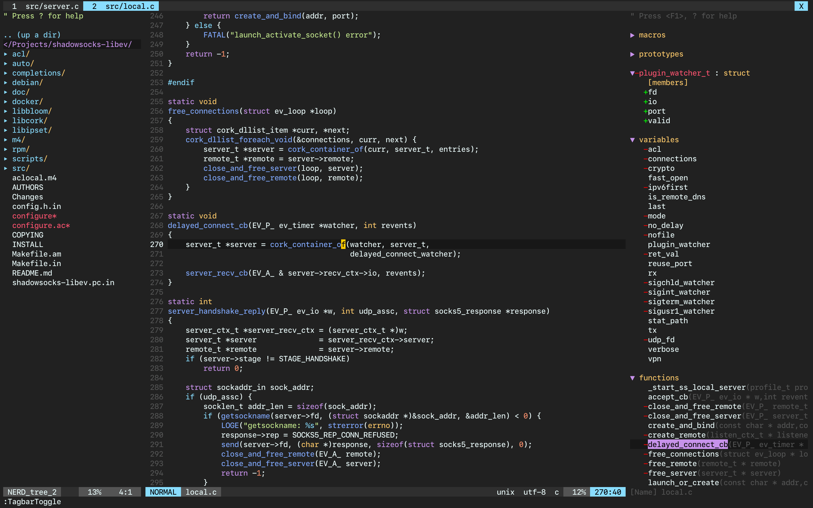
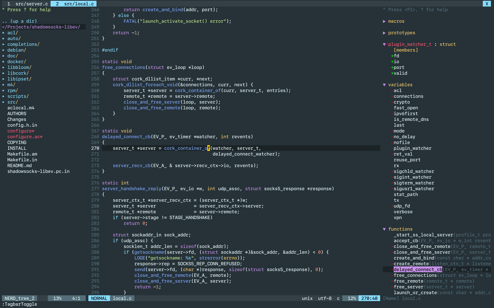

# equinusocio's material theme for vim

[](https://spdx.org/licenses/Apache-2.0.html)

[](https://github.com/hyzeta)
[](mailto:hyzeta@outlook.com)

This theme was ported from [equinusocio/vsc-material-theme](https://github.com/equinusocio/vsc-material-theme).

Try this theme if others don't meet your needs.

## screenshots

### default



### darker



## how to use

**IMPORTANT: True colors are required for vim in terminal**

* vim-plug

```vim
Plug 'Hyzeta/vim_equinusocio_material'

" true colors are required for vim in terminal
set termguicolors

" if you prefer the default one, comment out this line
let g:equinusocio_material_style='darker'

" comment out this line to make vertsplit invisible
let g:equinusocio_material_vertsplit='visible'

colorscheme equinusocio_material

" this theme has a buildin lightline theme, you can turn it on
let g:lightline = {
    \ 'colorscheme': 'equinusocio_material',
    \ }
```

## Other

If you are using iterm, you can try this [Hyzeta/iterm2-equinusocio-material](https://github.com/Hyzeta/iterm2-equinusocio-material).
