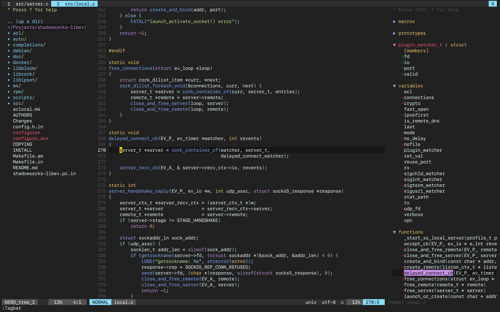

# equinusocio's material theme for vim

This theme was ported from [equinusocio/vsc-material-theme](https://github.com/equinusocio/vsc-material-theme).

Try this theme if others don't meet your needs.

## screenshots

### default



### darker


## how to use

**IMPORTANT: True colors are required for vim in terminal**

* vim-plug

```vim
Plug 'chuling/vim_equinusocio_material'

" true colors are required for vim in terminal
set termguicolors

" if you prefer the default one, comment out this line
let g:equinusocio_material_style='darker'

" comment out this line to make vertsplit invisible
let g:equinusocio_material_vertsplit='visible'

colorscheme equinusocio_material

" this theme has a buildin lightline theme, you can turn it on
let g:lightline = {
    \ 'colorscheme': 'equinusocio_material',
    \ }
```

## Other

If you are using iterm, you can try this [chuling/iterm2-equinusocio-material](https://github.com/chuling/iterm2-equinusocio-material).

## License

```
Copyright 2017-2019 chuling <meetchuling@outlook.com>

Licensed under the Apache License, Version 2.0 (the "License");
you may not use this file except in compliance with the License.
You may obtain a copy of the License at

    http://www.apache.org/licenses/LICENSE-2.0

Unless required by applicable law or agreed to in writing, software
distributed under the License is distributed on an "AS IS" BASIS,
WITHOUT WARRANTIES OR CONDITIONS OF ANY KIND, either express or implied.
See the License for the specific language governing permissions and
limitations under the License.
```
