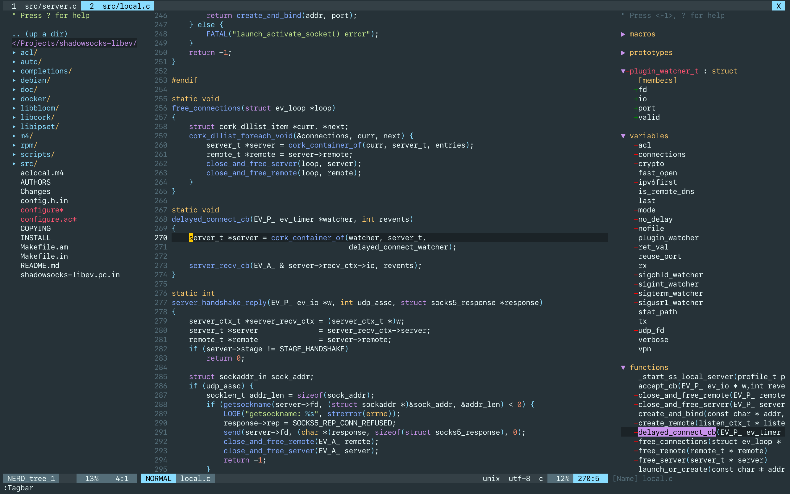

# equinusocio's material theme for vim

```
author: ling(github.com/hyzeta)
email of author: hyzeta@outlook.com
license: apache-2.0
```

This theme was ported from [equinusocio/vsc-material-theme](https://github.com/equinusocio/vsc-material-theme).

## screenshots

### darker



### default


## how to use

**IMPORTANT: True colors are required**

* vim-plug

```vim
Plug 'Hyzeta/vim_equinusocio_material'

" if you prefer the default one, comment out this line
let g:equinusocio_material_style='darker'

colorscheme equinusocio_material

" this theme has a buildin lightline theme, you can turn it on
let g:lightline = {
    \ 'colorscheme': 'equinusocio_material',
    \ }
```

## why prefer this one instead of the official material vim theme

That one is too ugly.